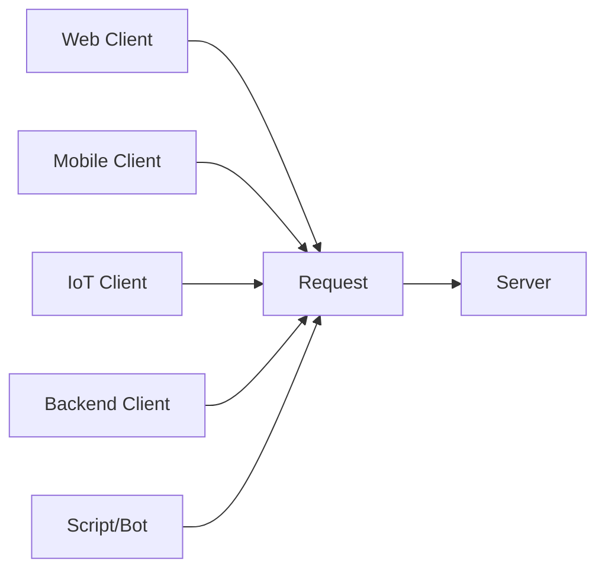
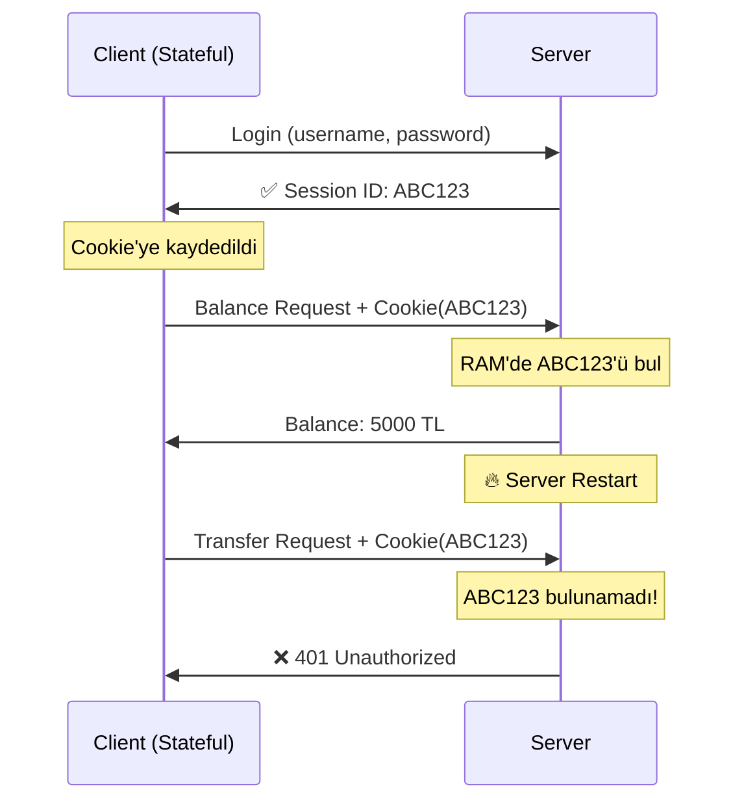

# 🧠 SYSTEM DESIGN MINDSET — DAY 01
## Client, State ve Stateful Tasarımın Anatomisi

> **Temel Prensip:** System design düşüncesi backend'de değil, **client'ta** başlar.  
> Çünkü büyük sistemlerdeki problemler request'in doğduğu yerde başlar.

---

## 📋 İçindekiler

1. [Client Nedir?](#1️⃣-client-nedir)
2. [Client'ın Sorumluluğu](#2️⃣-clientın-sorumluluğu-ne-olmalı)
3. [Stateful Client'ın Tehlikesi](#3️⃣-client-stateful-olursa-ne-olur)
4. [State Nedir?](#4️⃣-state-nedir)
5. [Stateful Model Anatomisi](#5️⃣-stateful-client-server-modeli)
6. [Projemizde Ne Yaptık?](#6️⃣-bu-projede-ne-yaptik)
7. [State Nerede Tutulur?](#7️⃣-state-nerede-tutulur)
8. [Server RAM'in Bedeli](#8️⃣-server-ramde-state-tutmanin-bedeli)
9. [Client Neden "Aptal" Olmalı?](#9️⃣-client-neden-aptal-olmali)
10. [Özet & Mülakat Sorusu](#-özet--mülakat-sorusu)

---

## 1️⃣ CLIENT NEDİR?

### System Design Tanımı

```
Client ≠ Sadece UI
Client = Request'i başlatan HER ŞEY
```

### Client Türleri

| Tür | Örnek | Özellik |
|-----|-------|---------|
| 🌐 **Web Client** | Chrome, Safari, Firefox | Browser-based |
| 📱 **Mobile Client** | iOS App, Android App | Native/Hybrid |
| 🤖 **IoT Client** | Sensör, Akıllı Cihaz | Edge Device |
| 🔧 **Backend Client** | Microservice, API Gateway | Server-to-Server |
| ⚙️ **Script/Bot** | Cron Job, Worker Thread | Automated |

### Ortak Özellik



📌 **Hepsi aynı işi yapar:** Request üretir, response bekler.

---

## 2️⃣ CLIENT'IN SORUMLULUĞU NE OLMALI?

### Tek Sorumluluk Prensibi

```
Client'ın görevi:
1. Request göndermek
2. Response almak
3. Sonucu göstermek
```

### Client Bilmemeli ❌

```javascript
// YANLIŞ ❌
const client = {
    businessLogic: "User balance > 100 ise transfer et",
    systemArchitecture: "3 server var, Redis kullan",
    backendState: "Session'da USER_ID var"
}
```

### Client Bilmeli ✅

```javascript
// DOĞRU ✅
const client = {
    identity: "Ben Ali'yim",
    request: "Bakiye görüntüle",
    display: "Sonucu ekrana bas"
}
```

### Akış Diyagramı

```
┌─────────────┐
│   CLIENT    │
│             │
│  ✅ Kim?    │──────┐
│  ✅ Ne?     │      │
│  ✅ Göster  │      │
│             │      │
│  ❌ Nasıl?  │      │ REQUEST
│  ❌ Nerede? │      │
│  ❌ Neden?  │      │
└─────────────┘      │
                     ▼
              ┌─────────────┐
              │   SERVER    │
              │             │
              │  İş Kuralı  │
              │  Mimari     │
              │  State      │
              └─────────────┘
```

---

## 3️⃣ CLIENT STATEFUL OLURSA NE OLUR?

### Kötü Senaryo

```
Client Stateful Olunca:
├── Client → Geçmişi taşır (Cookie, LocalStorage)
├── Client → Backend'e sıkı bağımlı
└── Server → "Bu client'ı hatırlamalıyım" 😰
```

### Problem Akışı



📌 **Sonuç:** Session gitti, client şaşkın!

---

## 4️⃣ STATE NEDİR?

### Tanım

```
State = Bir request'in sonraki request'i etkilemesi
```

### Basit Örnek

```
┌──────────┐
│ Request 1│  →  Login(ali, 1234)
└──────────┘
     │
     ▼  Server hatırlıyor: "Ali login oldu"
     │
┌──────────┐
│ Request 2│  →  GetBalance()  (Ali'nin bakiyesi)
└──────────┘
```

### State Var mı? Test

```python
# STATE VAR MI TESTI

# Senaryo 1
client.login("ali", "1234")  # Request 1
client.getBalance()          # Request 2

# Soru: Server Request 2'de "Bu Ali" diyor mu?
# Cevap: EVET → STATE VAR ✅

# Senaryo 2
client.calculate(5 + 3)      # Request 1
client.calculate(10 * 2)     # Request 2

# Soru: Request 2, Request 1'i biliyor mu?
# Cevap: HAYIR → STATE YOK ❌ (Stateless)
```

---

## 5️⃣ STATEFUL CLIENT-SERVER MODELİ

### Mimari Akış

```
┌─────────────────────────────────────────────┐
│              CLIENT TARAYICI                │
│                                             │
│  ┌────────────────────────────────────┐    │
│  │     Cookie Storage                 │    │
│  │  JSESSIONID=ABC123XYZ              │    │
│  │  (Client bunu bilmez, taşır)       │    │
│  └────────────────────────────────────┘    │
└─────────────────────────────────────────────┘
                     │
                     │ HTTP Request
                     │ Cookie: JSESSIONID=ABC123XYZ
                     ▼
┌─────────────────────────────────────────────┐
│              SERVER (RAM)                   │
│                                             │
│  ┌────────────────────────────────────┐    │
│  │   Session Store (In-Memory)        │    │
│  │                                    │    │
│  │   ABC123XYZ → {                    │    │
│  │     userId: 42,                    │    │
│  │     loginTime: "2024-01-15",       │    │
│  │     lastActivity: "2024-01-15"     │    │
│  │   }                                │    │
│  └────────────────────────────────────┘    │
└─────────────────────────────────────────────┘
```

### Adım Adım Ne Oluyor?

```
1. Client → Login(ali, 1234)
   ↓
2. Server → Doğrula → SESSION_ID oluştur (ABC123)
   ↓
3. Server → RAM'e yaz: ABC123 = {userId: 42}
   ↓
4. Client → Cookie'ye kaydet: JSESSIONID=ABC123
   ↓
5. Client → GetBalance() + Cookie(ABC123)
   ↓
6. Server → RAM'den bul: ABC123 → userId: 42
   ↓
7. Server → DB'den çek: User(42).balance
   ↓
8. Client → Ekranda göster
```

📌 **İşte bu Stateful tasarım!**

---

## 6️⃣ BU PROJEDE NE YAPTIK?

### Proje Yapısı

```
system-design-day01/
├── controller/
│   ├── AuthController.java           # Login/Logout (Session oluşturma)
│   ├── AccountController.java        # Balance/Transfer (Session kullanma)
│   
├── service/
│   └── UserService.java              # İş mantığı (authentication, transfer)
├── model/
│   └── User.java                     # JPA Entity (id, username, password, balance)
├── dto/
│   ├── LoginRequest.java             # Login input
│   ├── LoginResponse.java            # Login output
│   ├── BalanceResponse.java          # Balance output
│   ├── TransferRequest.java          # Transfer input
│   └── TransferResponse.java         # Transfer output
├── repository/
│   └── UserRepository.java           # Spring Data JPA Repository
└── config/
    └── DataInitializer.java          # Test verileri (ali, ayse, mehmet)
```

### Bilinçli Seçim: Stateful

```java
// AccountController.java
@GetMapping("/balance")
public ResponseEntity<?> getBalance(HttpSession session) {
    // 1. Session'dan USER_ID al (RAM'den)
    Long userId = (Long) session.getAttribute("USER_ID");
    String username = (String) session.getAttribute("USERNAME");
    
    if (userId == null) {
        // Session yoksa 401 dön
        return ResponseEntity.status(401)
            .body("Unauthorized: Please login first");
    }
    
    // 2. Bakiye sorgula
    BigDecimal balance = userService.getBalance(username);
    
    // 3. Response dön
    return ResponseEntity.ok(new BalanceResponse(username, balance));
}
```

### Proje Özellikleri

| Özellik | Durum | Açıklama |
|---------|-------|----------|
| **Session kullanımı** | ✅ Var | HttpSession (Spring Boot) |
| **Session'da data** | ✅ USER_ID, USERNAME | RAM'de tutuluyor |
| **Stateful mi?** | ✅ Evet | Server geçmişi hatırlıyor |
| **Ölçeklenebilir mi?** | ⚠️ Kısmen | Tek server ile sınırlı |
| **Database** | ✅ H2 In-Memory | Development için ideal |
| **Test kullanıcıları** | ✅ 3 adet | ali, ayse, mehmet (password: 1234) |
| **Easter Egg** | 🥚 Var | `/api/easter-egg/session-truth` |

### Katman Mimarisi (Layered Architecture)

```
┌──────────────────────────────────────────────┐
│        REST API Layer (Controllers)          │
│   AuthController, AccountController          │
│   - HTTP Request/Response handling           │
│   - Session management                       │
└──────────────────────────────────────────────┘
                    ↓
┌──────────────────────────────────────────────┐
│       Service Layer (UserService)            │
│   - Business logic                           │
│   - Authentication                           │
│   - Transfer validation                      │
└──────────────────────────────────────────────┘
                    ↓
┌──────────────────────────────────────────────┐
│   Repository Layer (UserRepository)          │
│   - Spring Data JPA                          │
│   - Database abstraction                     │
└──────────────────────────────────────────────┘
                    ↓
┌──────────────────────────────────────────────┐
│      Database Layer (H2 In-Memory)           │
│   - User table                               │
│   - Auto-populated test data                 │
└──────────────────────────────────────────────┘
```

### Neden Stateful Yaptık?

```
Amaç: Stateful'un problemlerini GÖRMEK

✅ Öğrenme amacıyla
✅ Problem simülasyonu
✅ Gerçek dünya deneyimi
✅ Stateless'a geçiş motivasyonu
✅ Multi-server test ortamı
```

### Kod İstatistikleri

| Katman | Dosya Sayısı | Açıklama |
|--------|--------------|----------|
| **Controllers** | 3 | Auth, Account |
| **Services** | 1 | Business logic |
| **Entities** | 1 | User (JPA) |
| **DTOs** | 5 | Request/Response objects |
| **Repositories** | 1 | Database access |
| **Config** | 1 | Data initializer |
| **Toplam** | 12 Java files | ~1000 satır kod |

---

## 7️⃣ STATE NEREDE TUTULUR?

### Kritik Karşılaştırma Tablosu

| Yer | State Var mı? | Ölçeklenebilir mi? | Performans | Kalıcı mı? |
|-----|---------------|-------------------|------------|-----------|
| **Client Memory** | ✅ | ✅ | ⚡ Hızlı | ❌ Geçici |
| **Cookie/SessionID** | ⚠️ | ✅ | ⚡ Hızlı | ⚠️ Sınırlı |
| **Server RAM** | ❌ | ❌ | ⚡⚡ Çok Hızlı | ❌ Geçici |
| **Cache (Redis)** | ⚠️ | ✅ | ⚡ Hızlı | ⚠️ TTL'e bağlı |
| **Database** | ✅ | ✅ | 🐌 Yavaş | ✅ Kalıcı |

### Tehlike Sıralaması

```
🔥🔥🔥 EN TEHLİKELİ: Server RAM
    └── Restart → State gider
    └── Yeni server → State yok
    └── Load balancer → Karmaşa

⚠️⚠️ ORTADERECELİ: Cache (Redis)
    └── TTL doldu → State gider
    └── Cluster'da senkronizasyon gerekli

✅✅ EN GÜVENLİ: Database
    └── Kalıcı
    └── ACID garantisi
    └── Ama yavaş
```

---

## 8️⃣ SERVER RAM'DE STATE TUTMANIN BEDELİ

### Canlı Deney: 2 Port 2 Server

```bash
# Terminal 1
java -jar app.jar --server.port=8080

# Terminal 2
java -jar app.jar --server.port=9090
```

### Problem Senaryosu

```
┌─────────────────────────────────────────────────┐
│              Load Balancer                      │
│         (Round Robin: 8080 ↔ 9090)             │
└─────────────────────────────────────────────────┘
           │                      │
           ▼                      ▼
    ┌───────────┐          ┌───────────┐
    │ Server A  │          │ Server B  │
    │ :8080     │          │ :9090     │
    │           │          │           │
    │ Session   │          │ Session   │
    │ ABC → Ali │          │ (Boş)     │
    └───────────┘          └───────────┘
```

### Ne Olur?

```
1. Client → Login → Server A (:8080)
   └── Session ABC123 → Ali

2. Client → GetBalance → Server B (:9090)
   └── Session ABC123 YOK!
   └── ❌ 401 Unauthorized

3. Client → Transfer → Server A (:8080)
   └── ✅ Çalışır (şans eseri A'ya düştü)

4. Server A → Restart
   └── Session gitti!
   └── Client hala ABC123 taşıyor
   └── ❌ Artık hiçbir şey çalışmaz
```

### Sonuç Tablosu

| Durum | Sonuç | Neden |
|-------|-------|-------|
| Server restart | ❌ Session kaybolur | RAM temizlenir |
| İkinci server eklendi | ❌ Session paylaşılmaz | Her server kendi RAM'i |
| Load balancer devrede | ❌ Client karışır | Rastgele server |

---

## 9️⃣ CLIENT NEDEN "APTAL" OLMALI?

### Altın Kural

```
Client ne kadar az bilirse,
Sistem o kadar büyür.
```

### İdeal Client Özellikleri

```javascript
// İDEAL CLIENT (Stateless)
class IdealClient {
  sendRequest(endpoint, data) {
    return fetch(endpoint, {
      method: 'POST',
      headers: {
        'Authorization': 'Bearer ' + this.getToken() // Her request'te token
      },
      body: JSON.stringify(data)
    });
  }
  
  // Client hiçbir şey bilmiyor:
  // ❌ Kaç server var?
  // ❌ Session nerede?
  // ❌ State nasıl tutuluyor?
  // ✅ Sadece token gönderiyor
}
```

### Büyük Şirketler Nasıl Yapıyor?

| Şirket | Yaklaşım |
|--------|----------|
| **Netflix** | JWT Token, Stateless |
| **Uber** | API Gateway, Token-based |
| **Twitter** | OAuth2, Stateless API |
| **Spotify** | Token refresh, No session |

### Karşılaştırma

```
┌──────────────────────────────────────┐
│   STATEFUL (Bu Proje)               │
├──────────────────────────────────────┤
│ Client → Cookie taşır               │
│ Server → RAM'de session tutar       │
│ Problem → Ölçeklenemez              │
└──────────────────────────────────────┘

┌──────────────────────────────────────┐
│   STATELESS (İdeal)                  │
├──────────────────────────────────────┤
│ Client → JWT token taşır            │
│ Server → Hiçbir şey hatırlamaz      │
│ Avantaj → Sonsuz ölçeklenebilir     │
└──────────────────────────────────────┘
```

---

## 🔥 SYSTEM DESIGN GERÇEĞİ (DAY 01)

```
┌─────────────────────────────────────────┐
│                                         │
│   State client'ta başlar                │
│   Ama server'da tutulursa               │
│   Sistem ÖLÜR                           │
│                                         │
└─────────────────────────────────────────┘
```

---

## 📚 ÖZET & MÜLAKAT SORUSU

### Bugün Ne Öğrendik?

1. ✅ Client, system design'ın başlangıç noktasıdır
2. ✅ Stateful tasarım ilk başta konforludur
3. ✅ Ama ölçek büyüdükçe sistem çöker
4. ✅ Session küçük olsa bile mimariyi bozar
5. ✅ Client "aptal" olmalı, server "unutkan" olmalı

### 🧠 Mülakatlık Tek Cümle

> **"Büyük sistemlerde client request gönderir, server geçmişi hatırlamaz."**

### Deney Soruları

```
1. Session'ı Redis'e taşısak ne olur?
   → Sonraki ders

2. JWT ile stateless'a geçsek ne değişir?
   → Day 02

3. Microservice'lerde session nasıl paylaşılır?
   → Day 03
```

---


## 📖 Kaynaklar

- [Spring Session Docs](https://spring.io/projects/spring-session)
- [Stateless vs Stateful Architecture](https://www.oreilly.com/library/view/building-microservices/9781491950340/)
- [CAP Theorem](https://en.wikipedia.org/wiki/CAP_theorem)

---

**Next:** [Day 02 - JWT ve Stateless Architecture →](./DAY-02.md)

---

<div align="center">

**Made with 🧠 for System Design Learners**

*Remember: The best architecture is the one that solves YOUR problem, not the trendy one.*

</div>